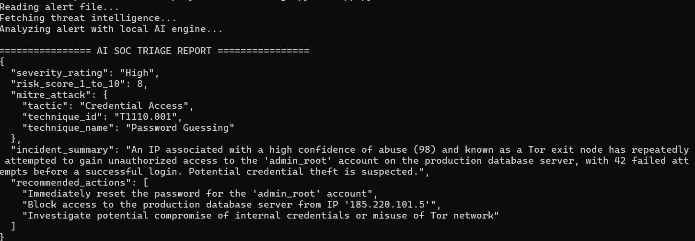

# AI-Driven SOC Alert Triage Engine

Automate Tier-1 SOC alert triage using **Python**, **Threat Intelligence Enrichment**, and a locally hosted **Mistral LLM** via **Ollama**.


## Overview

The **AI-Driven SOC Alert Triage Engine** automates the initial investigation of security alerts typically handled by Level-1 Security Operations Center (SOC) analysts.

The application ingests a JSON-formatted security alert, enriches the source IP with threat intelligence, and leverages a locally hosted **Mistral** model through **Ollama** to generate a structured triage report. The output includes severity assessment, incident summary, MITRE ATT&CK mapping, confidence score, and recommended response actions.

This project demonstrates the integration of **Cybersecurity**, **Threat Intelligence**, and **Generative AI** to streamline incident response workflows.


## Features

* Automated Tier-1 SOC alert triage
* Threat intelligence enrichment for source IP addresses
* AI-powered incident analysis using Mistral (Ollama)
* MITRE ATT&CK tactic and technique mapping
* Structured JSON output for easy SIEM integration
* Fully local LLM inference for privacy and low latency

## Tech Stack

* Python
* Ollama
* Mistral LLM
* Requests
* JSON
* MITRE ATT&CK Framework


## Workflow

```text
Security Alert (alert.json)
            │
            ▼
   Threat Intelligence Enrichment
            │
            ▼
      Prompt Construction
            │
            ▼
     Mistral (via Ollama)
            │
            ▼
   AI-Generated Triage Report
            │
            ▼
     SOC Analyst Review
```

## Project Structure

```text
.
├── app.py
├── alert.json
├── screenshot.png
└── README.md
```

## Requirements

* Python 3.10 or later
* Ollama installed
* Mistral model downloaded

## Quick Start

### 1. Install Ollama

Download and install Ollama from:

https://ollama.com


### 2. Pull the Mistral model

```bash
ollama pull mistral
```

### 3. Install Python dependencies

```bash
pip install requests
```

### 4. Run the application

```bash
python app.py
```

## Sample Input (`alert.json`)

```json
{
  "alert_id": "SEC-88219",
  "timestamp": "2026-07-27T14:20:10Z",
  "event_type": "Multiple Failed Logins Followed by Success",
  "source_ip": "185.220.101.5",
  "destination_host": "prod-db-server-01",
  "user_account": "admin_root",
  "failed_attempts": 42,
  "raw_log": "Failed password for root from 185.220.101.5 port 51102 ssh2; Accepted password for root from 185.220.101.5 port 51108 ssh2"
}
```

## Sample Output

```json
{
  "severity": "High",
  "confidence": 95,
  "incident_summary": "Multiple failed SSH login attempts followed by a successful authentication indicate a possible brute-force attack.",
  "mitre_attack": {
    "tactic": "Credential Access",
    "technique": "Brute Force (T1110)"
  },
  "recommended_actions": [
    "Block the source IP address",
    "Reset affected credentials",
    "Review authentication logs",
    "Enable multi-factor authentication"
  ]
}
```

## Screenshot



## Learning Outcomes

This project demonstrates practical experience with:

* Security Operations Center (SOC) workflows
* Threat Intelligence integration
* Prompt Engineering
* Local LLM deployment using Ollama
* Python API development
* JSON data processing
* MITRE ATT&CK mapping
* AI-assisted cybersecurity automation
